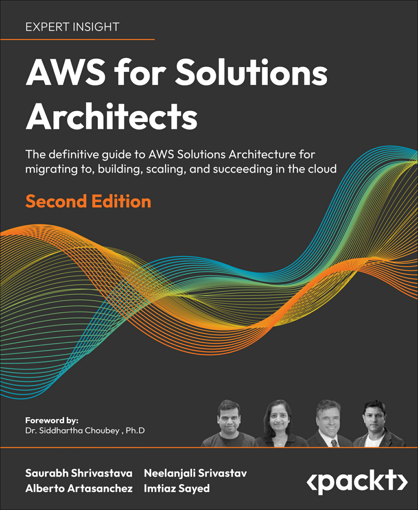
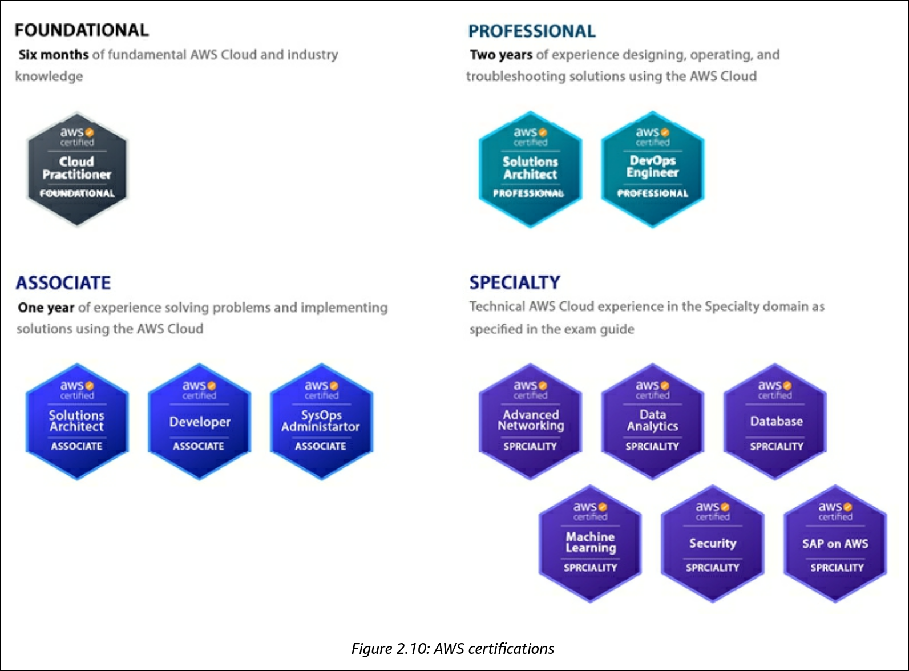
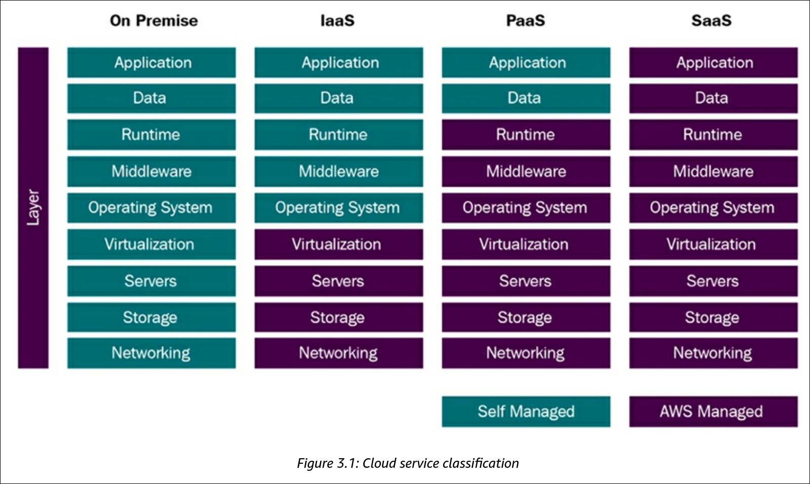

# My notes from "AWS for Solution Architects" by S. Shrivasta, N. Srivastav, A. Artasanchez, I.Sayed

 

<!-- omit in toc -->
## Contents

- [1. Understanding AWS Principles and Key Characteristics](#1-understanding-aws-principles-and-key-characteristics)
  - [Basic cloud and AWS terminology](#basic-cloud-and-aws-terminology)
- [2. Understanding the AWS Well-Architected Framework](#2-understanding-the-aws-well-architected-framework)
  - [The six pillars of the AWS Well-Architected Framework](#the-six-pillars-of-the-aws-well-architected-framework)
  - [AWS Well-Architected Lenses](#aws-well-architected-lenses)
  - [AWS Certifications](#aws-certifications)
- [3. Leveraging the Cloud for Digital Transformation](#3-leveraging-the-cloud-for-digital-transformation)
  - [Cloud Computing Models](#cloud-computing-models)
    - [Understanding IaaS](#understanding-iaas)
    - [Understanding SaaS](#understanding-saas)

##  1. Understanding AWS Principles and Key Characteristics

- AWS was launched in 2006
- Major companies begain migrating to AWS in 2008, including Netflix, Robinhood, Lyft, Capital One, and GE.
- AWS has over 200 services and has been the market leader in cloud computing for over a decade.

### Basic cloud and AWS terminology

Cloud providers have different names for the same concepts:

| Service                              | AWS                                                                                                                | Azure                                                                                  | GCP                                                                                           |
|-------------------------------------- |--------------------------------------------------------------------------------------------------------------------|----------------------------------------------------------------------------------------|-----------------------------------------------------------------------------------------------|
| **Compute**                          | • Amazon EC2 • Lightsail                                                                                        | • Azure Virtual Machines • Virtual Machine Scale Sets                               | • Google Compute Engine • Graphics Processing Unit (GPU)                                   |
| **Containers**                       | • Amazon Elastic Container Service (ECS) • Amazon Fargate • Elastic Container Service for Kubernetes • Elastic Container Registry • Batch • Amazon EMR | • Azure Kubernetes Service (AKS) • Container Instances • Batch • Service Fabric • Cloud Services | • Google Kubernetes Engine • Knative • Container Security                               |
| **Serverless Technologies**           | • AWS Lambda                                                                                                       | • Azure Functions                                                                      | • Google Cloud Functions                                                                      |
| **Relational Databases**              | • Amazon Relational Database Service (RDS) • Aurora • Redshift                                               | • Azure SQL Database • Data Warehouse • Server Stretch Database • Table Storage • Redis Cache • Data Factory | • Google Cloud SQL • Cloud Spanner                                                         |
| **NoSQL Databases (Key Value)**       | • Amazon DynamoDB                                                                                                  | • Azure Table Storage                                                                  | • Google Cloud Datastore • Google Cloud Bigtable                                           |
| **NoSQL Databases (Indexed)**         | • Amazon SimpleDB                                                                                                  | • Azure Cosmos DB                                                                      | • Google Cloud Datastore                                                                      |
| **Object Storage**                    | • Amazon Simple Storage Service (S3)                                                                               | • Azure Blob Storage                                                                   | • Google Cloud Storage                                                                        |
| **File Storage**                      | • Amazon Elastic Block Store (EBS) • Snowball • Snowball Edge • Snowmobile • Amazon Elastic File System (EFS) | • Azure Managed Disks • Azure File Storage                                          | • Google Compute Engine Persistent Disks • Persistent Disk • ZFS/Avere • Transfer Appliance • Transfer Service |
| **Archival Storage**                  | • Amazon Glacier                                                                                                   | • Azure Archive Storage                                                                | • Google Cloud Storage Nearline and Coldline                                                  |
| **Domain Name Service (DNS)**         | • Amazon Route 53                                                                                                  | • Azure DNS                                                                            | • Google Cloud DNS                                                                            |
| **Peering**                           | • Amazon DirectConnect                                                                                             | • Azure ExpressRoute                                                                   | • Google Cloud Interconnect                                                                   |
| **Virtual Networking**                | • Amazon Virtual Private Cloud (VPC)                                                                               | • Azure Virtual Networks (VNets)                                                        | • Google Virtual Private Cloud                                                                |
| **Elastic Load Balancing**            | • Amazon Elastic Load Balancer                                                                                     | • Azure Load Balancer                                                                  | • Google Cloud Load Balancing                                                                 |
| **PaaS services**                     | • AWS Elastic Beanstalk • VMware Cloud on AWS                                                                   | • App Service and Cloud Services                                                        | • Google App Engine                                                                           |
| **Machine Learning**                  | • SageMaker • Machine Learning • Rekognition • Lex • Polly • Comprehend • Translate • Transcribe • DeepLens • Deep Learning AMIs | • Machine Learning • Azure Bot Service • Cognitive Services                      | • Google Cloud Machine Learning Engine • Dialogflow • Google Cloud Natural Language • Google Cloud Speech API • Google Cloud Translation API • Google Cloud Video Intelligence • Google Cloud Job

## 2. Understanding the AWS Well-Architected Framework

### The six pillars of the AWS Well-Architected Framework

- Reference: [AWS Well-Architected Framework](https://docs.aws.amazon.com/wellarchitected/latest/framework/welcome.html)

**1. Security**
   - Strong identity foundation
   - Enable traceability
   - Apply security at all levels
   - Automate security best practices
   - Protect data in transit and at rest
   - Keep people away from data
   - Prepare for security events

**2. Reliability**
   - Automatically recover from failure
   - Test recovery procedures
   - Scale horizontally to increase aggregate workload availability
   - Stop guessing capacity
   - Manage change in automation

**3. Performance Efficiency**
   - Democratize advanced technologies
   - Go global in minutes
   - Use serverless architectures
   - Experiment more often
   - Mechanical sympathy
     - Write software in a way that plays nicely with how the machine actually works.

**4. Cost Optimization**
- Implement cloud financial management
- Adopt a consumption model
- Measure overall efficiency
- Stop spending money on undifferentiated heavy lifting
    - Don't waste time, money, or resources building and maintaining IT infrastructure or services that don't set your business apart.
- Analyze and attribute expenditure

**5. Operational Excellence**
- Perform operations as code
- Make frequent, small, reversible changes
- Refine operations procedures frequently
- Anticipate failure
- Learn from all operational failures

**6. Sustainability**
- Understand your impact
- Establish sustainability goals
- Maximize utilization
- Anticipate and adopt new, more efficient hardware and software offerings
- Use managed services
- Reduce downstream impact of your cloud workloads

### AWS Well-Architected Lenses

As of April 2025, AWS has launched 22 [Well-Architected Lenses](https://aws.amazon.com/architecture/well-architected/?ams%23interactive-card-vertical%23pattern-data.filter=%257B%2522filters%2522%253A%255B%255D%257D#:~:text=Learn%20more-,AWS%20Well%2DArchitected%20Lenses,-AWS%20Well%2DArchitected) addressing architecting needs to specific technology workloads and industry domains.

- Serverless Applications Lens
- Internet of Things (IoT) Lens
- Data Analytics Lens
- Machine Learning Lens
- Hybrid Networking Lens
- Generative AI Lens
- Container Build Lens
- Serverless Application Lens
- (more...)

You can apply various lenses to your workloads, which will get you a best-practice checklist specific to the domain.

### AWS Certifications

## 3. Leveraging the Cloud for Digital Transformation

### Cloud Computing Models

#### Understanding IaaS

Advantages of IaaS:
- Offers the most fexibility of all the cloud models
- Provisioning of compute, storage, and networking resources can be done quickly
- Resources can be used for a few minutes, hours, or days
- Complete control of the infrastructure
- Highly scalable and fault-tolerant

Disadvantages of IaaS:
- Security: customers need to manage a more comprehensive security plan
- Legacy systems: modifications to older applications may be required to run in the cloud
- Training costs: staff may need training to manage the new infrastructure

Use cases for IaaS:
- Backups and snapshots
- Disaster recovery
- Web hosting
- Software development environments
- Data analytics

Examples of AWS IaaS services:
- Elastic Compute Cloud (EC2) - a server on the cloud
- Elastic Block Storage (EBS) - block-level storage (i.e. SAN drive on the cloud)
- Elastic File Storage (EFS) - file-level storage (i.e. NAS drive on the cloud)

#### Understanding SaaS

Characteristics of SaaS:
- Managed by the vendor (such as AWS)
- Hosted on a third-party server
- Accessed over the Internet
- AWS manages applications, infrastructure, operating systems, and updates

Advantages of SaaS:
- Reduces time, money, effort spent on repetitive tasks
- Shifting the responsibility for installing, patching, configuring, and upgrading to a third party
- Allows you to focus on task that require more personalized attention

Disadvantages of SaaS:
- Interoperability: SaaS applications may not integrate well with existing systems
- Customization: SaaS applications may not be customizable to meet specific business needs
- Lack of control: non-deterministic latency issues
- Limited features

Use cases for SaaS:
- Payroll applications, such as ADP
- CRM solutions, such as Salesforce
- Workplace collaboration tools, including Zoom, Cisco Webex, Microsoft Teams, and Slack
- Office management solutions, such as Office 365
- Workplace solutions, including Amazon WorkSpaces, Google Workspace, and Microsoft Workspace

Examples of AWS SaaS services:
- Amazon Connect - a cloud-based contact center service
- Amazon WorkSpaces - a cloud-based desktop service (Windows or Linux)&mdash;a VDI solution
- Amazon QuickSight - business intelligence and analytics service for creating charts and visualizations
- Amazon Chime - similar to Slack and Zoom; used for online meetings, video conferencing, and chat

Examples of third-party SaaS solutions:
- Splunk - a log management and analysis tool that collects data from disparate sources
- Sendbird - a real-time chat solution for mobile apps and websites
- Twilio -  a cloud communications platform that enables developers to build voice, video, and messaging applications
